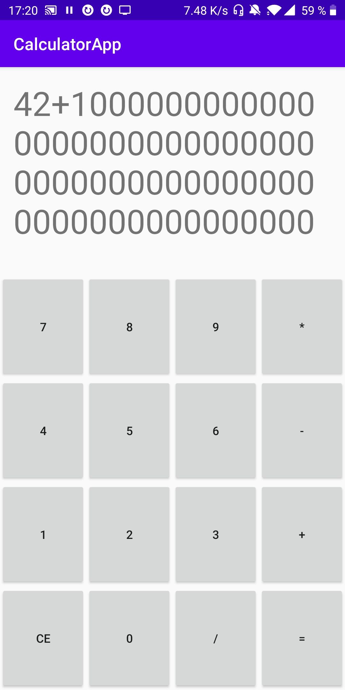
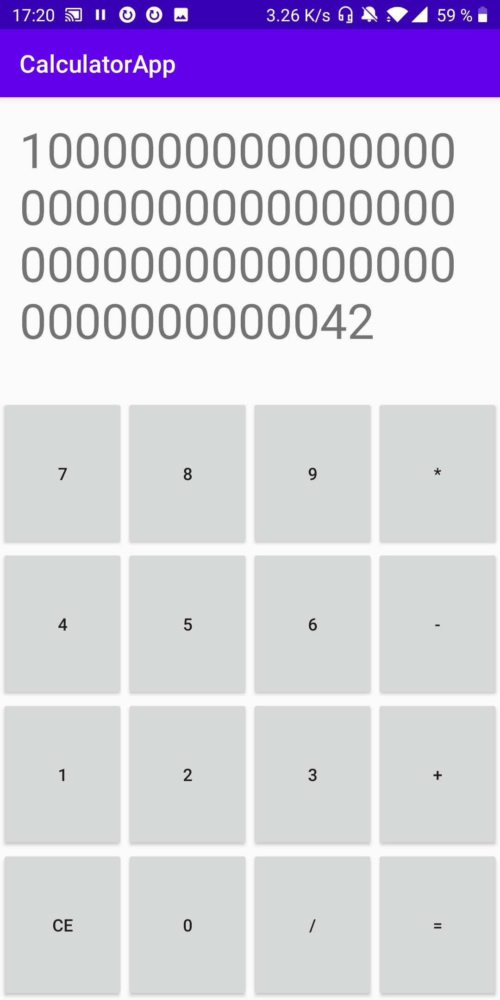

# CalculatorApp

## Some facts
* simple calculator app
* only supports addition at the moment
* supports reaaaaaaally big numbers (bigger than a googol)
* in theory the maximum number that can be stored is a one with 2,147,483,648 zeros minus one
* in practise the size of the number is limited by the size of the text-container in the ui
* app architecture is Model View Intent (MVI) 

## Screenshots
| Enter huge addition | Klick "=" and see the result | 
| ------------- |:-------------:| 
| | 

## Interesting classes
* [BigNumberCalculator implementation](app/src/main/java/de/maaxgr/calculatorapp/utils/BigNumberCalculator.kt)
* [BigNumberCalculator implementation unit tests](app/src/test/java/de/maaxgr/calculatorapp/BigNumberCalculatorTest.kt)
* [Activity for Main Screen](app/src/main/java/de/maaxgr/calculatorapp/ui/main/MainActivity.kt)
* [View Model for Main Screen](app/src/main/java/de/maaxgr/calculatorapp/ui/main/MainViewModel.kt)
* [ViewState, ViewEffects and ViewEvents for Main Screen](app/src/main/java/de/maaxgr/calculatorapp/ui/main/MainViewState.kt)

## External resources

* kotlin language by JetBrains
* androidx libraries by Google
* junit for unit testing
* personal library with some android architecture utilities
    * [Github](https://github.com/MaaxGr/ArchitectureComponentUtils)
* mvi architecture implementation by Rohit Surwase   
    * [Github](https://github.com/RohitSurwase/AAC-MVI-Architecture)
    * [Medium post](https://proandroiddev.com/best-architecture-for-android-mvi-livedata-viewmodel-71a3a5ac7ee3)
